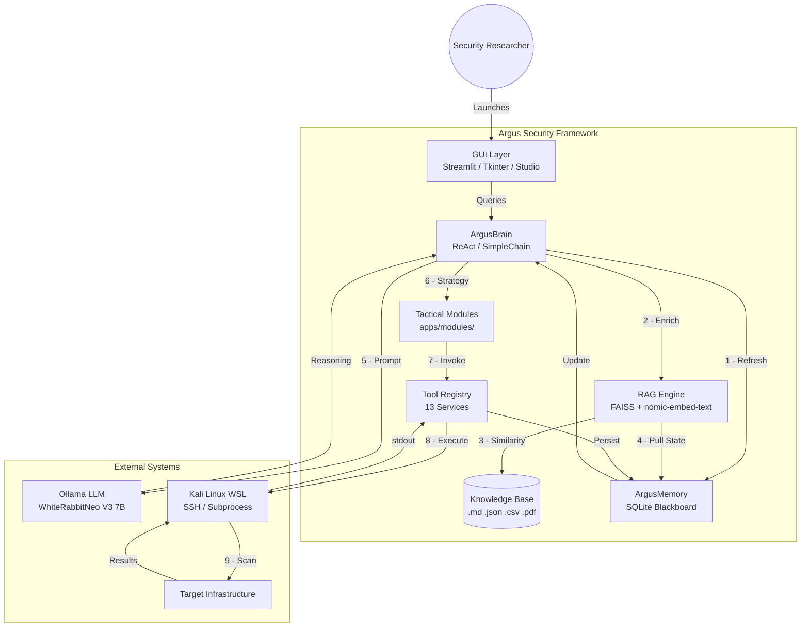

# Argus Security Framework

Argus is a professional-grade security analysis system and autonomous AI agent
studio, bridging Windows accessibility with Kali Linux's offensive power.



---

## Quick Start

### 1. Install (First Time Only)

Run the **Single-Click Installer** to set up WSL2, Kali Linux, Python, Ollama,
AI models, and all security tools in one go.

**File:** `INSTALL.bat` (at the project root)

The installer will auto-elevate to Administrator and write a log to
`logs\argus_install_<timestamp>.log`.

A system reboot may be required after WSL2 features are enabled.

### 2. Launch the Studio (Daily Use)

**File:** `scripts\LAUNCH_STUDIO.bat`

Starts the AI engine, activates the SSH bridge, and opens your browser at
`http://localhost:12199`.

---

## System Diagnostics

The installer runs an embedded health check automatically at the end of every
install. To verify the system manually at any time:

```powershell
powershell -NoProfile -ExecutionPolicy Bypass -File scripts\ARGUS_INSTALLER.ps1 -SkipHealthCheck:$false
```

The health check verifies: Argus_venv, Ollama, Kali (WSL), and SSH bridge (port 22).

---

## Project Structure

```text
remote_Argus_PhilopaterSh/
+-- INSTALL.bat                     # Single-click master installer (launcher)
+-- scripts/
|   +-- ARGUS_INSTALLER.ps1         # Unified self-elevating installer (single source of truth)
|   +-- LAUNCH_STUDIO.bat            # Streamlit web UI launcher
|   +-- LAUNCH_CLI.bat               # CLI agent launcher
|   +-- run_argus_cli.py             # CLI entry point
|   +-- README.md                   # Scripts usage guide
|
+-- Setup/                          # Legacy installation scripts (manual fallback)
|   +-- Step_1_Core_Foundation.bat
|   +-- Step_2_AI_Python_Env.bat
|   +-- Step_3_Kali_Tools_Setup.bat
|   +-- check_and_install.sh        # Kali tools installer (run inside WSL)
|   +-- requirements.txt            # Python dependencies
|   +-- README.md                   # Legacy setup guide
|
+-- app/                            # Main application
|   +-- GUI/                        # Streamlit web UI
|   +-- core/                       # AI brain, config
|   +-- tools/                      # Security tool modules
|   +-- modules/                    # Specialized exploit scripts
|
+-- docs/                           # Technical documentation
+-- tests/                          # Test suites
+-- data/                           # Data & databases
+-- logs/                           # Installer & runtime logs
+-- bin/                            # Executables
+-- archive/                        # Deprecated code
+-- Plan md/                        # Implementation plans
```

---

## Key Features

- **Parallel Reconnaissance:** Executes multiple tools (WhatWeb, Wafw00f, Nikto, etc.)
  simultaneously for maximum speed.
- **AI Intelligence:** Integrated with WhiteRabbitNeo for advanced security reasoning.
- **WSL Bridge:** Securely executes offensive tools inside a native Linux environment
  via SSH (port 22).
- **Report Export:** Download comprehensive security reports in Markdown format.

---

## Installation Modes

The master installer (`scripts\ARGUS_INSTALLER.ps1`) supports these modes:

| Mode | Flag | Description |
|------|------|-------------|
| Default (full) | *(none)* | Full install with auto-elevation |
| Dry Run | `-DryRun` | Simulate without system changes |
| Offline | `-Offline` | Skip all network downloads |
| Interactive | `-Interactive` | Confirm before each step |
| Skip Health | `-SkipHealthCheck` | Skip final health check |

You can pass modes via `INSTALL.bat` too: `INSTALL.bat dryrun`, `INSTALL.bat offline`.

---

*Maintained by: Argus Security Framework Team | June 2026*
