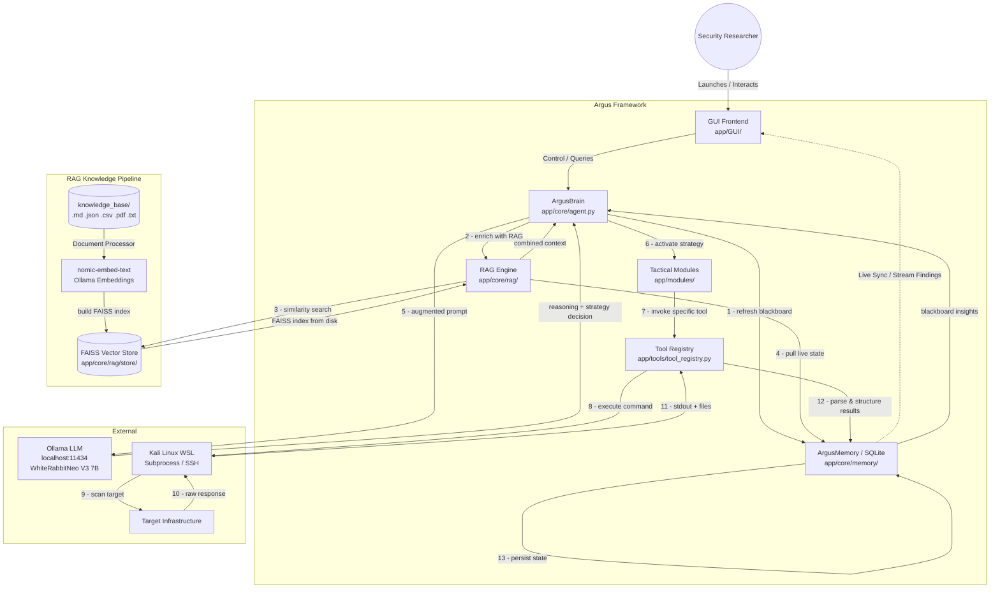
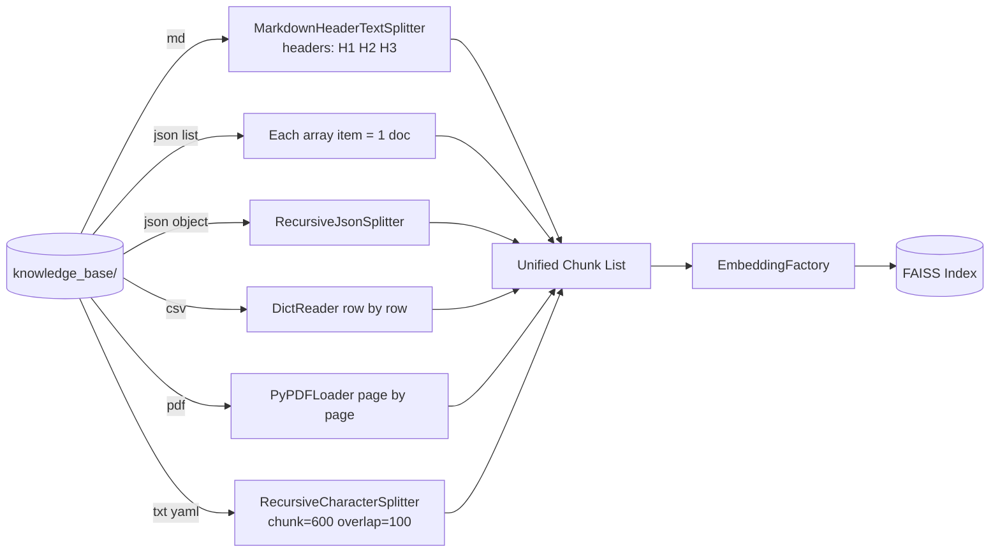
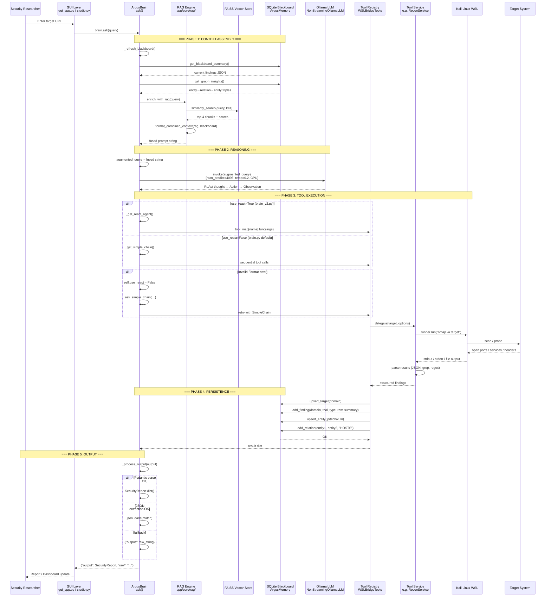
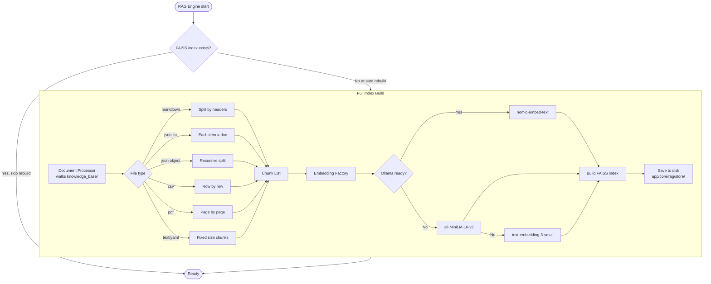
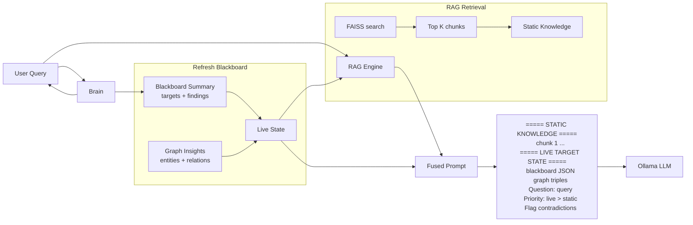

# Architecture Documentation: Argus Security Framework (arc42 & C4)

This document provides a detailed technical overview of the Argus Security Framework architecture, structured according to the **arc42** template and visualized using the **C4 Model** concepts.

---

## 1. Introduction and Goals

Argus is an autonomous AI-driven security reasoning engine that bridges the gap between high-level AI logic and low-level offensive security tools.

### 1.1 Goals
- **Autonomy:** Minimize human intervention in reconnaissance and initial vulnerability discovery.
- **Self-Healing:** Autonomously detect and resolve missing dependencies or tool failures.
- **Tactical Orchestration:** Empower the AI to manage low-level tools directly via CLI for maximum flexibility.
- **Reflective Verification:** Implement logic-based validation to eliminate false positives and WAF traps.
- **Cross-Platform Integration:** Seamlessly bridge Windows (AI/GUI) and Kali Linux (Security Tools).
- **Persistence:** Maintain a "Shared Blackboard" of intelligence across sessions.
- **RAG-Augmented Reasoning:** Retrieve relevant technical knowledge and prior findings at query time to ground AI decisions.

---

## 2. Architecture Constraints
- **Local Execution:** Must run locally (via Ollama) to ensure data privacy during pentesting.
- **WSL Dependency:** Requires Windows Subsystem for Linux (Kali) for security tool access.
- **Environment Isolation:** Python logic must reside in `Argus_venv`.
- **Vector Store**: Requires FAISS (CPU) for similarity search over embedded knowledge.
- **Embedding Model**: Requires Ollama `nomic-embed-text` or HuggingFace `all-MiniLM-L6-v2` as fallback.

---

## 3. Context and Scope (C4 Level 1: System Context)

### 3.1 High-Level System Context



---

## 4. Solution Strategy
- **Hybrid Language Model:** Using LangChain for reasoning (Brain) and Python Subprocess/SSH for execution (Body).
- **Containerized Tooling:** Leveraging WSL as a "Tool Container" to avoid polluting the host OS.
- **Graph-Based Memory:** Using SQLite to store not just raw text, but relationships (entities and relations).
- **RAG-Based Context Fusion:** Retrieving static technical knowledge (FAISS) and merging it with live target state (Blackboard) before each LLM query.

---

## 5. Building Block View (C4 Level 2: Containers)

### 5.1 Complete System Building Blocks

#### Core Components

| Component | Path | Responsibility |
|-----------|------|----------------|
| **ArgusBrain** | `app/core/brain.py`, `brain_v2.py` | ReAct/SimpleChain controller; triggers `_enrich_with_rag()` then `ask()` |
| **RAG Engine** | `app/core/rag/rag_engine.py` | Orchestrates retrieval + context fusion via `format_combined_context()` |
| **Embedding Factory** | `app/core/rag/embeddings.py` | Singleton: Ollama nomic-embed-text → HuggingFace → OpenAI fallback |
| **Document Processor** | `app/core/rag/document_processor.py` | Structural chunking per file type (see §5.2) |
| **Vector Store** | `app/core/rag/vector_store.py` | FAISS build/persist/load/similarity_search |
| **ArgusMemory** | `app/core/memory/memory_service.py` | SQLite Blackboard with 5 tables (targets, findings, entities, relations, global_state) |
| **Tool Registry** | `app/tools/tool_registry.py` | WSLBridgeTools facade — 12 sub-services |
| **Tactical Modules** | `app/modules/` | High-level attack workflows (deep exploit, stealth, recon) |
| **GUI** | `app/GUI/` | Streamlit (`gui_app.py`), Tkinter (`argus_gui.py`), Studio (`studio.py`) |
| **Knowledge Base** | `knowledge_base/` | Static source files ingested into FAISS |

#### Tool Services (inside `app/tools/`)

| Service | Class | Function |
|---------|-------|----------|
| Recon | `ReconService` | Subdomain enum, WAF detection, tech identification |
| Scanners | `VulnerabilityScanners` | Port scan, vuln scan via nuclei/nmap |
| Crawler | `CrawlerService` | Web crawling, endpoint discovery |
| Command Runner | `CommandRunner` | WSL / SSH command execution |
| WSL Bridge | `WSLBridge` | Low-level WSL subprocess management |
| Evasion | `EvasionService` | Payload obfuscation, WAF bypass |
| Payloads | `PayloadSuggester` | Exploit payload generation |
| Secrets | `SecretAnalyzer` | Secret/key detection in files |
| Self-Heal | `SelfHealingService` | Auto-fix missing deps (pip/apt) |
| Reflective | `ReflectiveVerificationService` | Content-level false positive elimination |
| Simulation | `ZEROAPTSimulation` | APT-style attack simulation |
| Web Search | `SmartWebSearch` | DuckDuckGo OSINT |
| Reachability | `ReachabilityService` | Target reachability validation |

### 5.2 Structural Chunking Strategy (DocumentProcessor)



### 5.3 Component Diagram (Full Accuracy)

```mermaid
graph TB
    subgraph "GUI Layer [app/GUI/]"
        Streamlit[gui_app.py<br/>Streamlit Web UI]
        Tkinter[argus_gui.py<br/>Tkinter Desktop]
        Studio[studio.py<br/>Argus Studio]
    end

    subgraph "Core Engine [app/core/]"
        Brain[ArgusBrain / ArgusBrainV2<br/>brain.py / brain_v2.py]
        LLM_Factory[build_llm()<br/>NonStreamingOllamaLLM<br/>CPU forced, stream=False]
        Agent_Factory[agent_factory.py<br/>build_agent_executor()]
        Agent_Factory_V2[agent_factory_v2.py<br/>SimpleChain Executor]
        Prompts[prompts.py<br/>ReAct Prompt Template]
        Schemas[schemas.py<br/>SecurityReport Pydantic]
    end

    subgraph "RAG Subsystem [app/core/rag/]"
        RAG_Engine[rag_engine.py<br/>RAGEngine]
        Emb_Factory[embeddings.py<br/>EmbeddingFactory]
        Doc_Proc[document_processor.py<br/>DocumentProcessor]
        VStore[vector_store.py<br/>VectorStore]
    end

    subgraph "Memory [app/core/memory/]"
        Mem_Service[memory_service.py<br/>ArgusMemory]
        DB[(argus_intelligence.db<br/>SQLite)]
        Mem_Service --> DB
        DB -->|5 tables| Targets[targets]
        DB --> Findings[findings]
        DB --> Entities[entities]
        DB --> Relations[relations]
        DB --> Global[global_state]
    end

    subgraph "Knowledge Base Files"
        KB_Files[(knowledge_base/<br/>.md .json .csv .pdf .txt)]
    end

    subgraph "Tool Services [app/tools/]"
        Registry[WSLBridgeTools<br/>tool_registry.py]
        Recon[ReconService]
        Scanners[VulnerabilityScanners]
        Crawler[CrawlerService]
        Evasion[EvasionService]
        Payloads[PayloadSuggester]
        Secrets[SecretAnalyzer]
        SelfHeal[SelfHealingService]
        Reflective[ReflectiveVerificationService]
        Simulation[ZEROAPTSimulation]
        WebSearch[SmartWebSearch]
        Reachability[ReachabilityService]
        CmdRunner[CommandRunner]
        WSL[WSLBridge]
    end

    subgraph "Tactical Modules [app/modules/]"
        Reasoning[argus_reasoning.py]
        DeepExploit[argus_deep_exploit.py]
        Stealth[stealth_exploit.py]
        RunRecon[run_recon.py]
        FullRecon[run_full_recon.py]
        MapTarget[map_target.py]
        SeedMem[seed_memory.py]
        DDGS[ddgs.py]
    end

    subgraph "External Systems"
        Ollama[(Ollama Server<br/>localhost:11434)]
        Kali[Kali Linux WSL<br/>wsl.exe / SSH]
        Target[Target Infrastructure]
    end

    Streamlit --> Brain
    Tkinter --> Brain
    Studio --> Brain

    KB_Files -->|load from dir| Doc_Proc
    Doc_Proc -->|structural chunking| Emb_Factory
    Emb_Factory -->|nomic-embed-text| VStore
    VStore -->|build and persist| VStore

    Brain -->|refresh blackboard| Mem_Service
    Brain -->|enrich with RAG| RAG_Engine
    RAG_Engine -->|combined context| VStore
    RAG_Engine -->|blackboard summary| Mem_Service

    Brain -->|build LLM| LLM_Factory
    LLM_Factory -->|invoke model| Ollama

    Brain -->|use ReAct| Agent_Factory
    Brain -->|fallback| Agent_Factory_V2
    Agent_Factory -->|ReAct agent| Prompts
    Agent_Factory_V2 -->|simple chain| Prompts

    Brain -->|tool dispatch| Registry
    Registry --> Recon
    Registry --> Scanners
    Registry --> Crawler
    Registry --> Evasion
    Registry --> Payloads
    Registry --> Secrets
    Registry --> SelfHeal
    Registry --> Reflective
    Registry --> Simulation
    Registry --> WebSearch
    Registry --> Reachability
    Registry --> CmdRunner
    CmdRunner --> WSL

    WSL -->|subprocess or SSH| Kali
    Kali -->|scan with tools| Target

    Target -->|scan results| Kali
    Kali -->|stdout and files| CmdRunner
    CmdRunner -->|parsed data| Registry
    Registry -->|persist to DB| Mem_Service
    Mem_Service -->|state change| Brain
```

---

## 6. Runtime View (C4 Level 3: Components)

### 6.1 Complete Query Lifecycle (Exact Code Path)



### 6.2 RAG Index Build Workflow (Exact Code Path)



### 6.3 Context Fusion: Prompt Assembly in enrich_with_rag



---

## 7. Deployment View (C4 Level 4: Code/Infrastructure)

- **Host OS:** Windows 10/11.
- **AI Engine:** Ollama (Localhost:11434) with models: `WhiteRabbitNeo-V3-7B`, `nomic-embed-text`.
- **Vector Store:** FAISS (CPU) persisted to `app/core/rag/store/`.
- **Environment:** `Argus_venv` (Python 3.12).
- **Directory Structure:**
  - `/app`: Core logic (core, tools, modules, GUI).
  - `/app/core/rag`: RAG subsystem (embeddings, vector store, document processor, engine).
  - `/knowledge_base`: Static source documents for RAG ingestion.
  - `/docs`: Documentation and workflows.
  - `/scripts`: Root-level operational utilities.
  - `/setup`: Environment installation resources.
- **Virtualization:** WSL 2 (Distro: kali-linux).
- **Bridge:** Local SSH (Port 22) or `wsl.exe` direct execution.

---

## 8. Cross-Cutting Concepts
- **Modular Tooling:** Tools are in category-specific services, improving testability.
- **Security:** API keys and credentials managed via `.env`.
- **Error Handling:** "Guided Reflection" with WAF detection and autonomous repair suggestions.
- **Reflective Verification:** Mandatory multi-step validation (Content-Length/Header checks) for all discoveries.
- **RAG Context Fusion:** Every LLM query is enriched with:
  - **Static Knowledge (FAISS):** General pentest techniques, cheatsheets, reference material from `knowledge_base/`.
  - **Live Target State (Blackboard):** Current findings, entities, relations discovered during active reconnaissance.
  - The prompt explicitly separates both sources with priority rules.
- **Structural Chunking:** Documents are split by structure (not just character count):
  - Markdown by headers, JSON by logical blocks, CSV row-by-row.
- **Persistence:** SQLite database (`argus_intelligence.db`) with relational mapping for Knowledge Graph visualization.
- **Automated Organization:** Centralized storage of tool-specific reports (e.g., `reports/nikto/`) with semantic, timestamped naming conventions.

---

## 9. Architecture Decisions (ADR)
- **ADR 1: Why SQLite?** Chosen for simplicity and zero-configuration, while supporting relational data needed for the Knowledge Graph.
- **ADR 2: Why WSL?** Provides a native Linux environment for industry-standard security tools while remaining accessible from Windows.
- **ADR 3: Why LangChain ReAct?** Standardizes how the AI interacts with tools, allowing for complex multi-step reasoning.
- **ADR 4: Autonomous Orchestration vs Static Scripts:** Shifted toward `Run_Kali_Command` to allow the AI to troubleshoot and pivot in real-time.
- **ADR 5: Self-Healing Logic:** Implemented `system_self_heal` to reduce "agent downtime".
- **ADR 6: Reflective Verification over Status-Only Discovery:** Mandated content-level validation because modern WAFs use deceptive "200 OK" redirects.
- **ADR 7: Autonomous Syntax Learning:** Empowered the agent to run `--help` commands on-the-fly.
- **ADR 8: Intelligent Rate-Limiting & IP Protection:** Automated halt-on-block logic to protect IP reputation.
- **ADR 9: Why nomic-embed-text?** Chosen as the primary embedding model because it runs locally via Ollama (no API key, no data leakage), provides 768-dim embeddings with strong retrieval accuracy, and falls back gracefully to HuggingFace/OpenAI.
- **ADR 10: Why RAG + Blackboard Fusion?** Separating static knowledge (techniques, cheatsheets) from live target state (active findings) prevents the LLM from confusing general knowledge with current reconnaissance data, reducing hallucination and improving decision accuracy.
- **ADR 11: Why Structural Chunking?** Different file formats carry meaning in their structure. JSON lists, CSV rows, and Markdown headers each require format-specific splitting to preserve semantic coherence during retrieval.
- **ADR 12: Why LangChain vs LangGraph?** LangChain is utilized for the linear, deterministic RAG indexing and query flow (docs, embeddings, FAISS) due to its specialized retrieval modules. LangGraph is selected for the autonomous Penetration Testing Agent to handle non-linear execution, cycles (e.g. feedback loops during failed exploits), multi-agent orchestration, and native state management without spaghetti code.

---

*Created by Argus Security Framework Team - June 2026*
