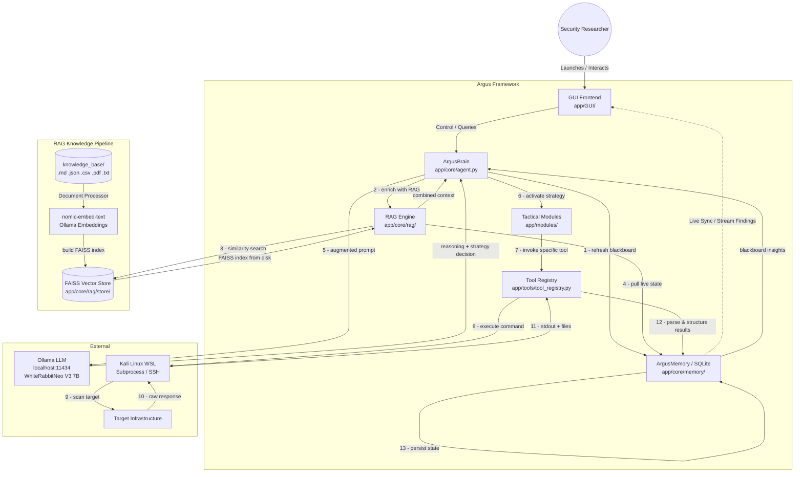
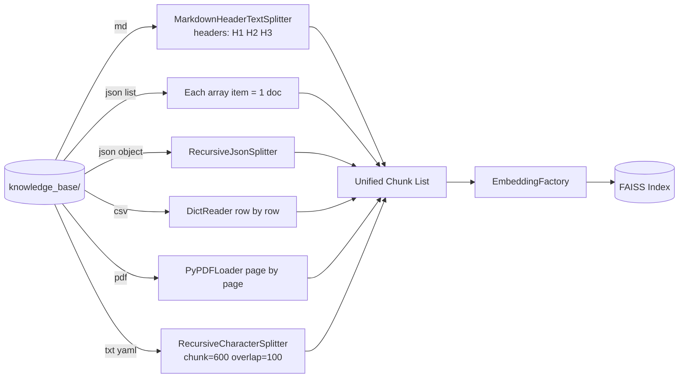
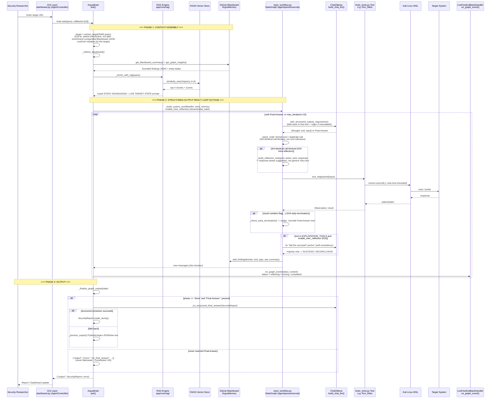
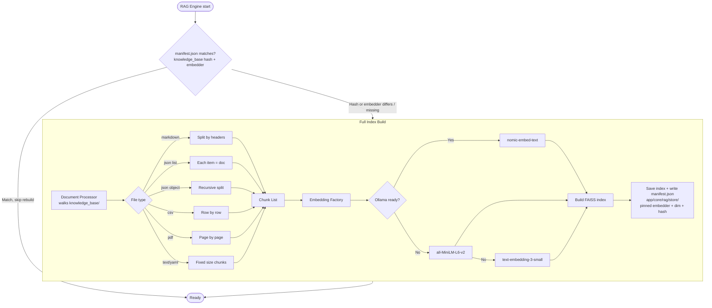
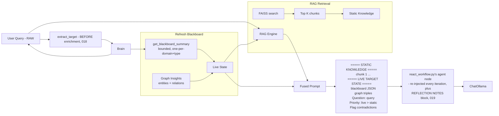

# Architecture Documentation: Argus Security Framework (arc42 & C4)

This document provides a detailed technical overview of the Argus Security Framework architecture, structured according to the **arc42** template and visualized using the **C4 Model** concepts.

> **Canonical reconciliation:** Cross-cutting naming, ports, Python version, RAG embedding/index design, parsing, testing, and CI/CD are governed by **`specs/012-spec-reconciliation`**. Where this document and `012` disagree, `012` wins - **except for agent topology**, where `012` §4's ADR-15 (a bounded `Recon -> Scanner -> Exploit ⇄ Reflective -> Post-Exploit` LangGraph node graph) was superseded as the production driver by **`specs/017-restore-react-agent`** (2026-07-08) after live testing found a single ReAct loop more reliable against this project's actual model than the multi-node graph - see ADR-17/18/19 below. `010`'s node graph (`app/core/agent/graph.py`, `nodes/`) is retained, not deleted (Constitution VII), but is not what `ArgusBrain` invokes today. This document was updated 2026-07-10 to describe the current `017`/`018`/`019` architecture accurately (single `ArgusBrain`, canonical RAG names, embedding manifest, port **12199**, Python **3.12**, **17** ReAct-loop tools via `brain_tools.py`).

> **Standing research foundation (per explicit project direction, 2026-07-10):** `docs/history/2603.27127v1.pdf` ("Red-MIRROR: Agentic LLM-based Autonomous Penetration Testing with Reflective Verification and Knowledge-augmented Interaction," arXiv:2603.27127v1) is not a one-time gap analysis - it is the **continuing reference framework this project measures itself against for the remainder of its development**. Concretely: SRMM (Shared Recurrent Memory Mechanism) motivated `specs/019`'s Blackboard/RAG memory-write discipline; Dual-Phase Reflection (Intra-/Inter-reflection) motivated `specs/019`'s duplicate-call blocking and 3x self-consistency majority vote on exploitation tools; the Planner Agent's global-context-aggregation-driven escalation (Sec. 3.3.2) motivated this entry's own PHASE 7 (Chaining & Escalation, see `react_prompts.py`) as a single-loop analogue. The paper's remaining unimplemented concepts (4-agent role split, LoRA fine-tuning, XBOW/Vulhub-style benchmarking) are tracked as the standing backlog in `specs/checklist.md` (`specs/020` through `specs/026`) and should stay the first place to look when deciding what to build next, not just when this document was first written.

---

## 1. Introduction and Goals

Argus is an autonomous AI-driven security reasoning engine that bridges the gap between high-level AI logic and low-level offensive security tools.

### 1.1 Goals
- **Autonomy:** Minimize human intervention in reconnaissance and initial vulnerability discovery.
- **Self-Healing:** Autonomously detect and resolve missing dependencies or tool failures.
- **Tactical Orchestration:** Empower the AI to manage low-level tools directly via CLI for maximum flexibility.
- **Reflective Verification:** Implement logic-based validation to eliminate false positives and WAF traps.
- **Cross-Platform Integration:** Seamlessly bridge Windows (AI/GUI) and Kali Linux (Security Tools).
- **Persistence:** Maintain a "Shared Blackboard" of intelligence across sessions.
- **RAG-Augmented Reasoning:** Retrieve relevant technical knowledge and prior findings at query time to ground AI decisions.

---

## 2. Architecture Constraints
- **Local Execution:** Must run locally (via Ollama) to ensure data privacy during pentesting.
- **WSL Dependency:** Requires Windows Subsystem for Linux (Kali) for security tool access.
- **Environment Isolation:** Python logic must reside in `Argus_venv`.
- **Vector Store**: Requires FAISS (CPU) for similarity search over embedded knowledge.
- **Embedding Model**: Requires Ollama `nomic-embed-text` or HuggingFace `all-MiniLM-L6-v2` as fallback.

---

## 3. Context and Scope (C4 Level 1: System Context)

### 3.1 High-Level System Context



---

## 4. Solution Strategy
- **Hybrid Language Model:** Using LangChain for reasoning (Brain) and Python Subprocess/SSH for execution (Body).
- **Containerized Tooling:** Leveraging WSL as a "Tool Container" to avoid polluting the host OS.
- **Graph-Based Memory:** Using SQLite to store not just raw text, but relationships (entities and relations).
- **RAG-Based Context Fusion:** Retrieving static technical knowledge (FAISS) and merging it with live target state (Blackboard) before each LLM query.

---

## 5. Building Block View (C4 Level 2: Containers)

### 5.1 Complete System Building Blocks

#### Core Components

| Component | Path | Responsibility |
|-----------|------|----------------|
| **ArgusBrain** | `app/core/agent/brain.py` | Reasoning interface: `_refresh_blackboard()` + `_enrich_with_rag()` context assembly (RAG + Blackboard fusion, `target` extracted from the *raw* pre-enrichment query per `018`'s CHK080 fix), then `_run_structured_graph()` drives `react_workflow.py`'s custom `StateGraph` (`_build_custom_workflow`) to completion via `.stream(stream_mode="values")`, forwarding each new message to any `on_graph_event(status, detail)` callback (`react_callback.py::LiveFeedCallbackHandler`) for live-feed observability. `_finalize_graph_output()` extracts the final answer via structured decoding (`_try_structured_final_answer`) with a Pydantic/regex-JSON fallback, never fabricating a report if the graph never reached `Final Answer:` (Constitution VIII). One retry on a known transient Ollama/CUDA infra crash signature (`018` addendum); any other exception fails immediately. The `brain_v2.py`/`agent_factory_v2.py`/dual `use_react` path this section previously described **does not exist** - it was proven non-functional (both branches called the identical `AgentExecutor`) and removed by `018`. |
| **ReAct Workflow** | `app/core/agent/react_workflow.py` (+`react_state.py`, `react_prompts.py`, `react_callback.py`) | `017`/`018`/`019`'s actual production reasoning loop: a 3-node `StateGraph` (`agent` -> `parse` -> `execute`, looping until `Final Answer:` or `max_iterations`=15). Tool selection tries Ollama schema-constrained structured decoding first (`_try_structured_action`, `ChatOllama.with_structured_output`), falling back to regex text parsing. `019` added: per-response Intra-reflection notes on a blocked 3rd-identical-call (`_build_reflection_note`), a 3x self-consistency majority-vote Inter-reflection check scoped to `EXPLOITATION_TOOLS` (`_inter_reflect`, gated by `enable_inter_reflection`), and an early-termination nudge on a `flag{...}`-shaped tool result (`_check_early_termination`) - see ADR-19. |
| **RAG Engine** | `app/core/rag/rag_engine.py` | Orchestrates retrieval + context fusion via `format_combined_context()` |
| **Embedding Factory** | `app/core/rag/embeddings.py` | Singleton: Ollama nomic-embed-text -> HuggingFace -> OpenAI fallback |
| **Document Processor** | `app/core/rag/document_processor.py` | Structural chunking per file type (see §5.2) |
| **Vector Store** | `app/core/rag/vector_store.py` | FAISS build/persist/load/similarity_search |
| **ArgusMemory** | `app/core/memory/memory_service.py` | SQLite Blackboard with 5 tables (targets, findings, entities, relations, global_state). `get_blackboard_summary(max_chars=3000)` (one survivor per domain+data_type, bounded by character count - the shape `Query_Memory`/GUI/TDA callers rely on verbatim) and, since `019`, the additive `summarize_for_planning(k=3)` (per-`(domain, tool_name)`-bounded, provenance-tagged `[tool_name] ...` lines, adapting Red-MIRROR's SRMM `GetAggregatedContext` to this schema) are separate methods with separate callers - see ADR-19. |
| **ReAct-Loop Tools** | `app/core/agent/brain_tools.py::build_argus_tools()` | The canonical **17**-tool list `ArgusBrain`'s ReAct loop actually calls - each a LangChain `Tool` wrapping a bound `WSLBridgeTools` method directly (`Check_Reachability`, `Recon_Suite`, `Run_Nikto`, `Advanced_Evasion_Probe`, `Secret_Scanner`, `Reflective_Pre_Verify`, etc.). **Distinct from** the row below - conflating the two was a real, since-fixed gap (`018` CHK090: this list was missing 5 working capabilities a sixth, independently-drifted copy still had). |
| **Generic Tool Registry** | `app/tools/tool_registry.py` (`WSLBridgeTools.registry`) + `app/core/registry/` (`ToolRegistry`, `BaseToolService`) | A plugin-style facade `WSLBridgeTools.__init__` builds and self-registers into via `_register_defaults()` - constructed on every `WSLBridgeTools()` instantiation, but **not** what drives `ArgusBrain`'s production tool calls (that's `brain_tools.py` above, which wraps the same `WSLBridgeTools` bound methods directly, bypassing this registry). Kept for `app/tools/self_heal.py` and other `BaseToolService` consumers; not on the ReAct-loop's hot path. |
| **Tactical Modules** | `app/modules/` | High-level attack workflows (deep exploit, stealth, recon) from an earlier architecture generation - confirmed by grep: **not imported anywhere under `app/core/` or `scripts/`**, i.e. not reachable from `ArgusBrain`'s current production path. Retained (Constitution VII), not deleted, but legacy relative to `017`/`018`/`019`. |
| **GUI** | `app/GUI/` | Streamlit (`dashboard.py`, canonical - `012` C3), Tkinter fallback (`desktop_gui.py`); `app.py`/`argus_gui.py`/`gui_main.py`/`studio.py` are deprecation shims. `gui_app.py`/`gui_root.py` deleted 2026-07-06 - unconditional import-time `brain.ask()` execution made them unsafe to even import, and they were 98% duplicates of each other, fully superseded by `dashboard.py`'s `AgentController`-based Agent tab. |
| **Knowledge Base** | `knowledge_base/` | Static source files ingested into FAISS |

#### Tool Services (inside `app/tools/`)

| Service | Class | Function |
|---------|-------|----------|
| Recon | `ReconService` | Subdomain enum, WAF detection, tech identification |
| Scanners | `VulnerabilityScanners` | Port scan, vuln scan via nuclei/nmap |
| Crawler | `CrawlerService` | Web crawling, endpoint discovery |
| Command Runner | `CommandRunner` | WSL / SSH command execution |
| WSL Bridge | `WSLBridge` | Low-level WSL subprocess management |
| Evasion | `EvasionService` | Payload obfuscation, WAF bypass |
| Payloads | `PayloadSuggester` | Exploit payload generation |
| Secrets | `SecretAnalyzer` | Secret/key detection in files |
| Self-Heal | `SelfHealingService` | Auto-fix missing deps (pip/apt) |
| Reflective | `ReflectiveVerificationService` | Content-level false positive elimination |
| Simulation | `ZEROAPTSimulation` | APT-style attack simulation |
| Web Search | `SmartWebSearch` | DuckDuckGo OSINT |
| Reachability | `ReachabilityService` | Target reachability validation |

### 5.2 Structural Chunking Strategy (DocumentProcessor)



### 5.3 Component Diagram (Full Accuracy)

```mermaid
graph TB
    subgraph "GUI Layer [app/GUI/]"
        Streamlit[dashboard.py<br/>Streamlit Web UI]
        Tkinter[desktop_gui.py<br/>Tkinter Desktop]
        Studio[studio.py<br/>Argus Studio]
    end

    subgraph "Core Engine [app/core/]"
        Brain[ArgusBrain<br/>brain.py]
        LLM_Factory[build_chat_llm()<br/>ChatOllama - required for<br/>with_structured_output, 018]
        ReactGraph[react_workflow.py<br/>_build_custom_workflow<br/>agent to parse to execute StateGraph]
        ReactState[react_state.py<br/>ArgusAgentState<br/>+reflection_notes, 019]
        ReactPrompts[react_prompts.py<br/>flat ReAct prompt<br/>+REFLECTION NOTES block, 019]
        ReactCallback[react_callback.py<br/>LiveFeedCallbackHandler<br/>on_graph_event]
        Agent_Factory[agent_factory.py<br/>build_agent_executor<br/>classic AgentExecutor - other callers only]
        Schemas[schemas.py<br/>SecurityReport Pydantic]
    end

    subgraph "RAG Subsystem [app/core/rag/]"
        RAG_Engine[rag_engine.py<br/>RAGEngine]
        Emb_Factory[embeddings.py<br/>EmbeddingFactory]
        Doc_Proc[document_processor.py<br/>DocumentProcessor]
        VStore[vector_store.py<br/>VectorStore]
    end

    subgraph "Memory [app/core/memory/]"
        Mem_Service[memory_service.py<br/>ArgusMemory]
        DB[(argus_intelligence.db<br/>SQLite)]
        Mem_Service --> DB
        DB -->|5 tables| Targets[targets]
        DB --> Findings[findings]
        DB --> Entities[entities]
        DB --> Relations[relations]
        DB --> Global[global_state]
    end

    subgraph "Knowledge Base Files"
        KB_Files[(knowledge_base/<br/>.md .json .csv .pdf .txt)]
    end

    subgraph "Tool Services [app/tools/]"
        Registry[WSLBridgeTools<br/>tool_registry.py]
        Recon[ReconService]
        Scanners[VulnerabilityScanners]
        Crawler[CrawlerService]
        Evasion[EvasionService]
        Payloads[PayloadSuggester]
        Secrets[SecretAnalyzer]
        SelfHeal[SelfHealingService]
        Reflective[ReflectiveVerificationService]
        Simulation[ZEROAPTSimulation]
        WebSearch[SmartWebSearch]
        Reachability[ReachabilityService]
        CmdRunner[CommandRunner]
        WSL[WSLBridge]
    end

    subgraph "Tactical Modules [app/modules/]"
        Reasoning[argus_reasoning.py]
        DeepExploit[argus_deep_exploit.py]
        Stealth[stealth_exploit.py]
        RunRecon[run_recon.py]
        FullRecon[run_full_recon.py]
        MapTarget[map_target.py]
        SeedMem[seed_memory.py]
        DDGS[ddgs.py]
    end

    subgraph "External Systems"
        Ollama[(Ollama Server<br/>localhost:11434)]
        Kali[Kali Linux WSL<br/>wsl.exe / SSH]
        Target[Target Infrastructure]
    end

    Streamlit --> Brain
    Tkinter --> Brain
    Studio --> Brain

    KB_Files -->|load from dir| Doc_Proc
    Doc_Proc -->|structural chunking| Emb_Factory
    Emb_Factory -->|nomic-embed-text| VStore
    VStore -->|build and persist| VStore

    Brain -->|refresh blackboard| Mem_Service
    Brain -->|enrich with RAG| RAG_Engine
    RAG_Engine -->|combined context| VStore
    RAG_Engine -->|blackboard summary| Mem_Service

    Brain -->|build_chat_llm| LLM_Factory
    LLM_Factory -->|invoke model| Ollama

    Brain -->|drives| ReactGraph
    ReactGraph -->|reads/writes| ReactState
    ReactGraph -->|builds prompt each turn| ReactPrompts
    Brain -->|streams messages to| ReactCallback
    Agent_Factory -.->|classic AgentExecutor -<br/>other callers, not ArgusBrain| Schemas

    ReactGraph -->|tool dispatch| Registry
    Registry --> Recon
    Registry --> Scanners
    Registry --> Crawler
    Registry --> Evasion
    Registry --> Payloads
    Registry --> Secrets
    Registry --> SelfHeal
    Registry --> Reflective
    Registry --> Simulation
    Registry --> WebSearch
    Registry --> Reachability
    Registry --> CmdRunner
    CmdRunner --> WSL

    WSL -->|subprocess or SSH| Kali
    Kali -->|scan with tools| Target

    Target -->|scan results| Kali
    Kali -->|stdout and files| CmdRunner
    CmdRunner -->|parsed data| Registry
    Registry -->|persist to DB| Mem_Service
    Mem_Service -->|state change| Brain
```

---

## 6. Runtime View (C4 Level 3: Components)

### 6.1 Complete Query Lifecycle (Exact Code Path - reflects `017`/`018`/`019`)

> This section previously described a `use_react`/`brain_v2.py`/`_get_simple_chain()` dual-path
> that a live production run (`018`) proved never actually existed as a real fallback - both
> branches called the identical `AgentExecutor`. That code was deleted in `018`; the diagram
> below is the current, verified-live architecture instead.



### 6.2 RAG Index Build Workflow (Exact Code Path)



### 6.3 Context Fusion: Prompt Assembly in enrich_with_rag

> **`018` ordering fix**: `target = extract_target(query)` MUST run on the raw query, *before*
> `_enrich_with_rag()` prepends the fused Blackboard/RAG block below - a live run found the
> Blackboard JSON's dot-separated keys (e.g. `"www.example.com:80":`) could be mistaken for the
> real target by `extract_target()`'s heuristic if extraction ran on the already-enriched text.



---

## 7. Deployment View (C4 Level 4: Code/Infrastructure)

- **Host OS:** Windows 10/11.
- **AI Engine:** Ollama (Localhost:11434) with models: `WhiteRabbitNeo-V3-7B`, `nomic-embed-text`.
- **GUI:** Streamlit "Argus Studio" dashboard on canonical port **12199** (`config.yaml` -> `streamlit.port`; per `012` §2.6 / ADR-16).
- **Vector Store:** FAISS (CPU) persisted to `app/core/rag/store/`, with `store/manifest.json` recording the pinned embedder (per ADR-9).
- **Environment:** `Argus_venv` (Python **3.12**, canonical across all specs per `012` §2.6).
- **Directory Structure:**
  - `/app`: Core logic (core, tools, modules, GUI).
  - `/app/core/rag`: RAG subsystem (embeddings, vector store, document processor, engine).
  - `/knowledge_base`: Static source documents for RAG ingestion.
  - `/docs`: Documentation and workflows.
  - `/scripts`: Root-level operational utilities.
  - `/setup`: Environment installation resources.
- **Virtualization:** WSL 2 (Distro: kali-linux).
- **Bridge:** Local SSH (Port 22) or `wsl.exe` direct execution.

---

## 8. Cross-Cutting Concepts
- **Modular Tooling:** Tools are in category-specific services, improving testability.
- **Security:** API keys and credentials managed via `.env`.
- **Structured-Output-First Reasoning (`018`):** Tool selection and the final report both try Ollama schema-constrained decoding (`llm.with_structured_output`) before falling back to regex text parsing - the standard fix for the format-drift failures free-text-only parsing was prone to on this project's local 7B model.
- **Dual-Phase Reflection (`019`):** Two distinct mechanisms, not one generic "error handling" catch-all:
  - **Intra-reflection:** `_build_reflection_note()` - when a duplicate tool call is blocked (3rd identical attempt), the guidance given back to the model is derived from the *actual prior response* (WAF-block, timeout, 404, 500 keyword heuristics), not a generic "try something different."
  - **Inter-reflection:** `_inter_reflect()` - a 3x self-consistency majority vote (Wang et al., ICLR 2023) on whether an `EXPLOITATION_TOOLS` call achieved a genuine finding, gated by `enable_inter_reflection`. Measured live to cost ~8% of a normal reasoning step's time, not the ~300% a naive "3 calls instead of 1" estimate would suggest - the vote's one-word-constrained output is cheap to decode regardless of round-trip count.
  - **Early termination:** `_check_early_termination()` - a `flag{...}`-pattern nudge, independent of the model choosing to say "Final Answer:" on its own.
- **Reflective Verification (`007`, distinct from `019`'s Dual-Phase Reflection above):** `ReflectiveVerificationService` - infinite-loop detection (3+ identical consecutive raw commands) and content-level false-positive elimination (Content-Length/Header checks), invoked as explicit tools (`Reflective_Pre_Verify`, `Task_Difficulty_Assessment`) the model may call, not a mandatory step in the loop itself.
- **RAG Context Fusion:** Every LLM query is enriched with:
  - **Static Knowledge (FAISS):** General pentest techniques, cheatsheets, reference material from `knowledge_base/`.
  - **Live Target State (Blackboard):** Current findings, entities, relations discovered during active reconnaissance. `target` is extracted from the *raw* query before this fusion happens (`018` fix - the fused block's own JSON keys could otherwise be mistaken for the target).
  - The prompt explicitly separates both sources with priority rules, and is rebuilt fresh every ReAct iteration (`react_prompts.py::build_react_system_prompt`), now also carrying the accumulated `REFLECTION NOTES` block (`019`).
- **Structural Chunking:** Documents are split by structure (not just character count):
  - Markdown by headers, JSON by logical blocks, CSV row-by-row.
- **Persistence:** SQLite database (`argus_intelligence.db`) with relational mapping for Knowledge Graph visualization. Two distinct read paths as of `019`: `get_blackboard_summary()` (one-per-domain+type, the long-standing shape existing callers/tests depend on) and the additive `summarize_for_planning()` (per-`(domain, tool_name)`-bounded, provenance-tagged).
- **Automated Organization:** Centralized storage of tool-specific reports (e.g., `reports/nikto/`) with semantic, timestamped naming conventions.
- **Truthful Runtime (Constitution VIII):** A run that never reaches a valid `Final Answer:` returns an honest `{"error": "no_final_answer", ...}` - never a fabricated report. Applies throughout `017`/`018`/`019`: the graph's `max_iterations` bound, the transient-infra-crash retry (exact-signature-matched only, not a general safety net), and Inter-reflection's majority vote (`_inter_reflect()` returns `None`, not a guessed `True`/`False`, if all 3 LLM calls raise) all follow this rule.

---

## 9. Architecture Decisions (ADR)
- **ADR 1: Why SQLite?** Chosen for simplicity and zero-configuration, while supporting relational data needed for the Knowledge Graph.
- **ADR 2: Why WSL?** Provides a native Linux environment for industry-standard security tools while remaining accessible from Windows.
- **ADR 3: Why LangChain ReAct?** Standardizes how the AI interacts with tools, allowing for complex multi-step reasoning.
- **ADR 4: Autonomous Orchestration vs Static Scripts:** Shifted toward `Run_Kali_Command` to allow the AI to troubleshoot and pivot in real-time.
- **ADR 5: Self-Healing Logic:** Implemented `system_self_heal` to reduce "agent downtime".
- **ADR 6: Reflective Verification over Status-Only Discovery:** Mandated content-level validation because modern WAFs use deceptive "200 OK" redirects.
- **ADR 7: Autonomous Syntax Learning:** Empowered the agent to run `--help` commands on-the-fly.
- **ADR 8: Intelligent Rate-Limiting & IP Protection:** Automated halt-on-block logic to protect IP reputation.
- **ADR 9: Why nomic-embed-text (and one embedder per index)?** Chosen as the primary embedding model because it runs locally via Ollama (no API key, no data leakage) and provides 768-dim embeddings with strong retrieval accuracy. **Correction (per `012` §3):** the HuggingFace/OpenAI fallback runs **only at index build time** to select an available embedder, which is then pinned in `app/core/rag/store/manifest.json` (name, provider, dimension, knowledge_base hash, schema_version). A FAISS index has a fixed dimensionality, so silent *query-time* substitution across 768/384/1536-dim models is invalid and forbidden; if the manifest embedder is unavailable and no rebuild is possible, RAG degrades to Blackboard-only rather than issuing a dimension-mismatched query. Rebuilds are triggered deterministically when the knowledge-base hash or the configured embedder differs from the manifest.
- **ADR 10: Why RAG + Blackboard Fusion?** Separating static knowledge (techniques, cheatsheets) from live target state (active findings) prevents the LLM from confusing general knowledge with current reconnaissance data, reducing hallucination and improving decision accuracy.
- **ADR 11: Why Structural Chunking?** Different file formats carry meaning in their structure. JSON lists, CSV rows, and Markdown headers each require format-specific splitting to preserve semantic coherence during retrieval.
- **ADR 12: Why LangChain vs LangGraph?** LangChain is utilized for the linear, deterministic RAG indexing and query flow (docs, embeddings, FAISS) due to its specialized retrieval modules. LangGraph is selected for the autonomous Penetration Testing Agent to handle non-linear execution, cycles (e.g. feedback loops during failed exploits), multi-agent orchestration, and native state management without spaghetti code.
- **ADR 13: Structured output over regex parsing (per `012` §5).** Tool/Action selection uses structured decoding as the primary path - native `tool_calls` for tool-calling models, and Ollama `format=json` (JSON-schema-constrained) for others - emitting `{ "tool": <name>, "input": <value> }`. The legacy JSON/text regex dual-parser (from `013`) is retained only as a fallback. Rationale: eliminates a whole class of parse failures and reduces retries/latency.
- **ADR 14: One canonical Brain + descriptive RAG names (per `012` §2).** The `_v2` shadow files (`brain_v2.py`, `agent_factory_v2.py`) are collapsed into a single `app/core/agent/brain.py` (`ArgusBrain`) and `agent_factory.py`; RAG modules keep the descriptive names `document_processor.py` / `vector_store.py` / `rag_engine.py` (not `010`'s `processor/vectorstore/engine`). Rationale: SRP/maintainability and one unambiguous name per concept.
- **ADR 15: Canonical agent topology = explicit bounded node graph (per `012` §4) - *superseded by ADR-17, see correction below*.** The production agent was originally the LangGraph node graph `Recon -> Scanner -> Exploit ⇄ Reflective -> Post-Exploit` in `app/core/agent/graph.py`/`nodes/`, bounded by `MAX_RETRIES` + a recursion limit. **Correction (`017`, 2026-07-08):** live testing found this multi-node graph less reliable against this project's actual model (`WhiteRabbitNeo-V3-7B`) than a single ReAct loop - `017` restored `ArgusBrain` to drive a single-loop agent instead. `010`'s graph is retained (Constitution VII: code + its tests stay, nothing deleted) but is **not** what `ArgusBrain` invokes today.
- **ADR 16: Unified Streamlit port 12199 (per `012` §2.6).** One value in `config.yaml` (`streamlit.port: 12199`), with `get_port.py`'s fail-safe default equal to it, consumed by every launcher and the `011` dashboard. Supersedes the divergent `8199`/`8501` values. Rationale: eliminates port drift at the source.
- **ADR 17: Restore a single ReAct loop as the production agent (`017`, 2026-07-08).** Reversing ADR-15's node-graph topology: `ArgusBrain.ask()` drives one `AgentExecutor`-style loop (later replaced by `react_workflow.py`'s custom graph, ADR-18) instead of the `010` multi-node graph. Rationale: the multi-node graph's phase-transition logic assumed reliability properties (consistent structured hand-offs between nodes) that didn't hold for a 7B local model prone to format drift; a single loop with one retry/reflection point per iteration proved more robust in practice. `brain_tools.py::build_argus_tools()` (17 tools) and `scripts/run_agent.py` are `017`'s canonical tool-wiring and CLI entry points.
- **ADR 18: Structured-output decoding over regex-only parsing for the ReAct loop (`018`, 2026-07-08).** A live production run (`https://www.cultbeauty.co.uk/`) timed out after 900s with zero results: `WhiteRabbitNeo-V3-7B` never once produced a valid free-text `Thought:/Action:/Action Input:` line across ~26 retries, and `ArgusBrain`'s claimed "falls back to a simpler sequential execution model" was never actually true (`_get_react_agent()`/`_get_simple_chain()` built the identical `AgentExecutor`). Fix: `react_workflow.py`'s custom `StateGraph` (`_build_custom_workflow`), already built for `013` but disconnected from production, tries Ollama schema-constrained structured decoding first (`llm.with_structured_output`, near-100% parse success per Ollama's own docs), falling back to regex parsing only if unavailable - applied to both tool selection (`_try_structured_action`) and the final report (`_try_structured_final_answer`). Requires `ChatOllama` (`build_chat_llm()`), not `OllamaLLM` (`build_llm()`) - the latter's `with_structured_output` raises `NotImplementedError`, confirmed live. `max_iterations` set to 15 (structured decoding needs far fewer retries than free-text parsing's old default of 50). A live re-run found and fixed 4 further real bugs (documented in `specs/018-structured-agent-reliability/spec.md`'s addendum) plus one mitigated transient Ollama/CUDA infrastructure crash (one retry, exact-signature-matched only).
- **ADR 19: SRMM/Dual-Phase-Reflection-inspired memory + reflection upgrade (`019`, 2026-07-10).** From a gap analysis against the Red-MIRROR paper (arXiv:2603.27127v1, `docs/history/2603.27127v1.pdf`), whose own ablation study found its Shared Recurrent Memory Mechanism and Dual-Phase Reflection components synergistic (not merely additive) - under adaptive/replacement-based input filtering, neither alone solved any challenge while the combination solved 100%. Adapted (not ported verbatim) to Argus's single-loop architecture: `ArgusMemory.summarize_for_planning(k=3)` (per-`(domain, tool_name)`-bounded, additive to - not replacing - `get_blackboard_summary()`, whose exact shape existing tests/callers depend on); `_build_reflection_note()` (response-aware Intra-reflection replacing generic duplicate-call text); `_inter_reflect()` (3x self-consistency majority vote, Wang et al. ICLR 2023, scoped to `EXPLOITATION_TOOLS` via `enable_inter_reflection`); `_check_early_termination()` (flag-pattern nudge, not a forced structural exit - `Final Answer:` remains the sole completion signal, Constitution VIII). Measured live against the production model (`specs/019.../tasks.md` T013): the 3x vote costs ~0.82s vs. a normal ~10.96s reasoning call (~8%, not the ~300% naively expected), because the vote prompt constrains output to one word and this model's decode time is output-token-bound - confirmed safe as the default by measurement, not assumption. Rationale for adapting rather than adopting the paper's full multi-agent split: see `specs/020-multi-agent-role-separation/spec.md` - `020` is deliberately deferred pending measurement of `019`'s residual gap.
- **ADR 20: Multi-agent role separation implemented experimentally, but rejected as default, on measured (not projected) evidence (`020`, 2026-07-11; merged onto `main` 2026-07-19).** User first proposed a heavier multi-*model* variant (a different physical GGUF model per role: Dolphin-Llama3 as Coordinator, DeepSeek-Coder as Exploit Analyst, an abliterated Llama-3-8B as Verifier). Researched before building: this project's actual hardware (`nvidia-smi`-confirmed 16GB VRAM, RTX 2000 Ada) cannot hold more than ~2 of those models resident at once, so 4-model swapping would trade a memory problem for an unmeasured latency one; abliteration specifically regresses TruthfulQA (-7.1 per a 2026 comparative study) while leaving other benchmarks near-unchanged - the wrong tradeoff for a Verifier role whose entire job is judging true vs. false findings; independent research ("Persona-Pruner") shows the field moving toward extracting multiple personas from one dense model rather than deploying several full models. Built the lighter, originally-scoped FR-001 design instead: one shared model, four role-scoped `(prompt, tool-subset)` configurations in a new standalone graph (`_build_multi_role_workflow`, deliberately not a generalization of the production `_build_custom_workflow`, so the proven single-loop path stays unaffected regardless of this experimental path's behavior) - `Planner` makes a structured routing decision, `Collector`/`Exploiter` each execute one tool call per visit, `Summarizer` produces the final report. Measured (not assumed) against the single-loop baseline (`specs/020/tasks.md` T006/T007): **2.00x the LLM calls** for an equivalent-effort scenario - a structural result (every specialist action pairs with one Planner routing decision), landing exactly at this spec's own pre-agreed 2x rollback threshold. **Not promoted to default** (`enable_multi_agent_roles: false`) - reported as a borderline, not a passing, result (Constitution VIII).
- **ADR 21: Browser automation (`022`) stays a plain tool the existing agent calls, not a separately-reasoning "AI Browser Agent" (2026-07-13).** Researched the distinction directly: a headless browser (Playwright) executes deterministic code; an "AI Browser Agent" (e.g. Browser-Use) is an LLM deciding actions dynamically *on top of* a headless browser - a genuinely separate, additional decision loop, even in frameworks' text-only (non-vision) modes that could technically run on a local small model. Adopting one would mean two independently-reasoning LLM loops for one task (Argus's own ReAct loop, plus the browser agent's internal one) - directly repeating the per-decision latency cost ADR-20 just measured with real numbers. `022`'s existing design (a plain `Render_Page_JS`/`Browser_Interact` tool pair Argus's own agent calls directly, FR-003's explicit "no in-tool LLM decision loop" stance) was already the right call before this research pass, not a gap - confirmed, not changed. Matches a pattern recent 2026 agentic-pentesting write-ups independently converge on ("Playwright MCP" - browser primitives exposed as callable tools for an existing agent, not a nested agent).

## 10. Research References

Every external source this project's architecture decisions have cited, grouped by the question
each research pass answered. Per-decision context and full reasoning live in the relevant
`specs/<phase>/research.md` (or the ADR entry above referencing it) - this section is the
consolidated bibliography, not a duplicate of that reasoning (Constitution IX). Primary source
for the whole `019`-`026` backlog is `docs/history/2603.27127v1.pdf` (Red-MIRROR,
arXiv:2603.27127v1) - listed once here, not repeated per topic below.

**RAG-augmented penetration-testing agent architecture** (grounding the general direction behind
`019`'s memory/reflection upgrade):
- [RAG Production Guide 2026 (Lushbinary)](https://lushbinary.com/blog/rag-retrieval-augmented-generation-production-guide/)
- [Design and Implementation of a RAG-Enhanced LLM Chatbot for Penetration Testing Tasks (ScienceDirect)](https://www.sciencedirect.com/science/article/pii/S1877050926006514)
- [SoK: Agentic Retrieval-Augmented Generation (arXiv:2603.07379)](https://arxiv.org/pdf/2603.07379)
- [RAG-Augmented LLMs for Penetration Testing: benchmarking open-source models (ScienceDirect)](https://www.sciencedirect.com/science/article/pii/S2667305326000566)
- [Securing Retrieval-Augmented Generation (arXiv:2604.08304)](https://arxiv.org/html/2604.08304v1)
- [LLM Pentesting: The 2026 Checklist (Repello AI)](https://repello.ai/blog/llm-pentesting-checklist-and-tools)
- [AI/LLM Penetration Testing Methodology - 2026 Playbook (AxVeil)](https://axveil.com/blog/ai-llm-penetration-testing-methodology)
- [Efficient RAG for VAPT in Automotive Engineering](https://doi.org/10.3390/a19070555)
- [Retrieval-Augmented Generation: Comprehensive Survey (arXiv:2506.00054)](https://arxiv.org/html/2506.00054v1)

**PayloadsAllTheThings dynamic payload extraction** (grounding `Advanced_Evasion_Probe`'s
`fetch_intruder_payloads()`, 2026-07-10):
- [awesome-wordlists (GitHub)](https://github.com/gmelodie/awesome-wordlists)
- [SecLists (GitHub)](https://github.com/danielmiessler/SecLists)
- [PayloadsAllTheThings (GitHub, swisskyrepo)](https://github.com/swisskyrepo/PayloadsAllTheThings)

**LLM tool-selection failure modes** (grounding `_extract_vulnerability_hints()`'s deterministic,
code-level evidence-extraction design over a prompt-only fix, 2026-07-11):
- [Looking Is Not Picking: An Attention-Segment Account of Tool-Selection Failures in LLM Agents (arXiv:2606.16364)](https://arxiv.org/abs/2606.16364)
- [ToolFailBench: Diagnosing Tool-Use Failures in LLM Agents (arXiv:2607.04686)](https://arxiv.org/html/2607.04686v1)
- [LLM Agents Already Know When to Call Tools - Even Without Reasoning (arXiv:2605.09252)](https://arxiv.org/html/2605.09252v1)

**Local model orchestration cost** (grounding `020`'s rejection of the multi-model variant,
2026-07-11):
- [Ollama vs vLLM: Performance Benchmark 2026 (SitePoint)](https://www.sitepoint.com/ollama-vs-vllm-performance-benchmark-2026/)
- [Performance Test: Ollama 0.5.0 vs. vLLM 0.4.0 (DEV Community)](https://dev.to/johalputt/performance-test-ollama-050-vs-vllm-040-local-llm-inference-latency-on-nvidia-rtx-5090-and-1pol)

**Abliteration's effect on model quality** (grounding `020`'s rejection of an abliterated model
for the Verifier/Summarizer role, 2026-07-11):
- [Comparative Analysis of LLM Abliteration Methods (arXiv:2512.13655)](https://arxiv.org/pdf/2512.13655)
- [Heretic vs Abliterated LLMs: Refusal Rates & Benchmarks (2026)](https://aithinkerlab.com/heretic-ai-abliteration-benchmarks-2026/)
- [The Cost of Abliteration in Large Language Models](https://kirill.korins.ky/articles/the-cost-of-abliteration-in-large-language-models/)

**Single dense model with multiple personas vs. multiple full models** (grounding `020`'s
FR-001 single-model design, 2026-07-11):
- [Single Dense Model Hosts Hundreds of Agent Personas as Lightweight Masks (ai\|expert, Persona-Pruner)](https://aiexpert.news/en/article/persona-pruner-lightweight-models-for-multi-agent-role-playing-systems)

**AI Browser Agent vs. plain headless browser** (grounding `022`'s tool-not-agent design,
2026-07-13):
- [Headless Browser vs AI Agents: When to Use Each (2026, TinyFish)](https://www.tinyfish.ai/blog/headless-browser-vs-ai-agents)
- [Browser Tools for AI Agents Part 1: Playwright, Puppeteer (DEV Community)](https://dev.to/stevengonsalvez/browser-tools-for-ai-agents-part-1-playwright-puppeteer-and-why-your-agent-picked-playwright-k71)
- [browser-use (GitHub)](https://github.com/browser-use/browser-use)
- [Supported Models - Browser Use docs](https://docs.browser-use.com/open-source/supported-models)
- [Using Ollama with Browser-Use to Leverage Local LLMs (Medium)](https://medium.com/@tossy21/using-ollama-with-browser-use-to-leverage-local-llms-6e1fba532b58)
- [AWE: Adaptive Agents for Dynamic Web Penetration Testing (arXiv:2603.00960)](https://arxiv.org/html/2603.00960)
- [Top 10 Agentic AI Penetration Testing Tools in 2026 (zerothreat.ai)](https://zerothreat.ai/blog/top-10-agentic-ai-penetration-testing-tools)
- [autopentest-ai (GitHub)](https://github.com/bhavsec/autopentest-ai)

**AI-agent exploit-development capability benchmarking** (grounding `021`/`023`'s exploitation-
toolkit and CVE-PoC-retrieval specs against an external, measured capability yardstick rather than
projection alone - full detail in both specs' `research.md` addenda, 2026-07-23):
- [ExploitGym (GitHub, sunblaze-ucb)](https://github.com/sunblaze-ucb/exploitgym)
- [ExploitGym: Can AI Agents Turn Security Vulnerabilities into Real Attacks? (arXiv:2605.11086)](https://arxiv.org/abs/2605.11086)
- [cybergym.io](https://cybergym.io)

**Playwright's own documentation** (grounding `022`'s locator-priority correction, 2026-07-10):
- `playwright.dev/docs/locators` (cited via `docs/history/2603.27127v1.pdf` reference [39], and
  independently checked against current Playwright documentation during `022`'s research pass).

**Additional browser-automation techniques** (grounding `022`'s FR-006/007/008 - network/HAR
capture, console/page-error capture for payload-execution verification, session-state
extraction - 2026-07-13):
- [How to Intercept API Calls Requests in Playwright](https://roundproxies.com/blog/intercept-network-playwright/)
- [Network - Playwright (official docs)](https://playwright.dev/docs/network)
- [XSS Vulnerability Tester MCP Server (PulseMCP)](https://www.pulsemcp.com/servers/xss-vulnerability-tester)
- [How to Monitor JavaScript Logs & Exceptions with Playwright (Checkly)](https://www.checklyhq.com/blog/how-to-monitor-javascript-logs-and-exceptions-with-playwright/)
- [Storage & Authentication - Playwright (official docs)](https://playwright.dev/agent-cli/commands/storage)
- [Using Playwright's storageState (BrowserStack)](https://www.browserstack.com/guide/playwright-storage-state)
- [mcp-browser (GitHub, badchars)](https://github.com/badchars/mcp-browser)
- [hexstrike-ai (GitHub)](https://github.com/0x4m4/hexstrike-ai)

**Local agent-model evaluation - vision/tool-use/reasoning capability vs. the current
`ArgusConfig.model_name` default** (grounding a benchmarked model-swap comparison run via
`benchmarks/runner.py`, specs/025's existing SR/SCR/TTE harness, against `WhiteRabbitNeo-V3-7B` -
this model has native tool calling but no vision and no dedicated reasoning/thinking mode,
confirmed by reading `app/core/llm_factory.py`/`app/core/agent/react_workflow.py` directly rather
than assumed, 2026-07-24):
- [Qwen3-VL-8B-Thinking-GGUF (Hugging Face)](https://huggingface.co/Qwen/Qwen3-VL-8B-Thinking-GGUF)
- [qwen3-vl official Ollama library listing](https://ollama.com/library/qwen3-vl:8b)
- [Qwen3-VL (GitHub, QwenLM)](https://github.com/qwenlm/qwen3-vl)
- [Qwen3-VL-4B vs 8B: Benchmarks, VRAM, Which to Run (codersera, 2026)](https://codersera.com/blog/qwen3-vl-4b-vs-qwen3-vl-8b-benchmarks-vram-guide/)
- [Best Local LLMs for Tool & Function Calling (Local AI Master, 2026)](https://localaimaster.com/blog/best-ollama-models-tool-calling)
- [GLM-4.6V-Flash-9B (Ollama, community quant)](https://ollama.com/haervwe/GLM-4.6V-Flash-9B)
- [GLM-V (GitHub, zai-org) - GLM-4.1V/4.5V/4.6V-Thinking multimodal reasoning](https://github.com/zai-org/GLM-V)
- [GLM-4.6: Run Locally Guide (Unsloth docs)](https://docs.unsloth.ai/models/glm-4.6-how-to-run-locally)
- [gpt-oss:20b (Ollama library)](https://ollama.com/library/gpt-oss:20b)
- [OpenAI gpt-oss (Ollama blog)](https://ollama.com/blog/gpt-oss)
- [WhiteRabbitNeo V3: AI-Native DevSecOps Model (Kindo)](https://www.kindo.ai/blog/introducing-whiterabbitneo-v3-the-next-generation-of-devsecops-ai)

---

*Created by Argus Security Framework Team - June 2026. Reconciled per `specs/012-spec-reconciliation`
- July 2026. Updated 2026-07-10 to replace the `brain_v2.py`/`agent_factory_v2.py`/`use_react`
dual-path this document previously described (confirmed, by direct filesystem search across the
whole repo, to no longer exist anywhere - deleted by `018` after being proven non-functional)
with the actual current `017`/`018`/`019` architecture: `react_workflow.py`'s structured-output
ReAct graph, `018`'s reliability fixes, and `019`'s Dual-Phase-Reflection/SRMM-inspired memory
upgrade. Every file path and function/class name in the updated sections (§5.1, §5.3, §6.1,
§6.3, §8, ADR-17/18/19) was independently verified to exist with `ls`/`grep` against the real
codebase before being written here, not assumed from memory - see the corresponding
verification pass in `CHANGELOG.md`. `app/core/agent/graph.py`/`nodes/` (the superseded `010`
node graph) and `app/modules/` (pre-`017` tactical modules) are confirmed still present on disk
- retained per Constitution VII, not deleted, just no longer reachable from `ArgusBrain`'s
production path. Updated 2026-07-13: added ADR-20 (`020`'s measured, not projected, rejection of
the multi-model variant and its NFR-001 result) and ADR-21 (`022`'s AI-Browser-Agent-vs-plain-tool
research finding) plus the new section 10 Research References section - a consolidated bibliography of
every external source this project's architecture decisions have cited, at the user's explicit
request, so the reasoning behind `019`-`022`'s design choices stays traceable to real sources
rather than living only in chat history. Updated 2026-07-24 (per Principle XI): added a new §10
entry recording sources for a local agent-model evaluation (vision/tool-use/reasoning capability
vs. the current `WhiteRabbitNeo-V3-7B` default) - the comparison itself is being run empirically via
`benchmarks/runner.py` before any `ArgusConfig.model_name` change is treated as decided; no ADR
added yet since no decision has been made, only the research grounding it (satisfies the
Research provenance gate for this pass even though the outcome is still pending).*
