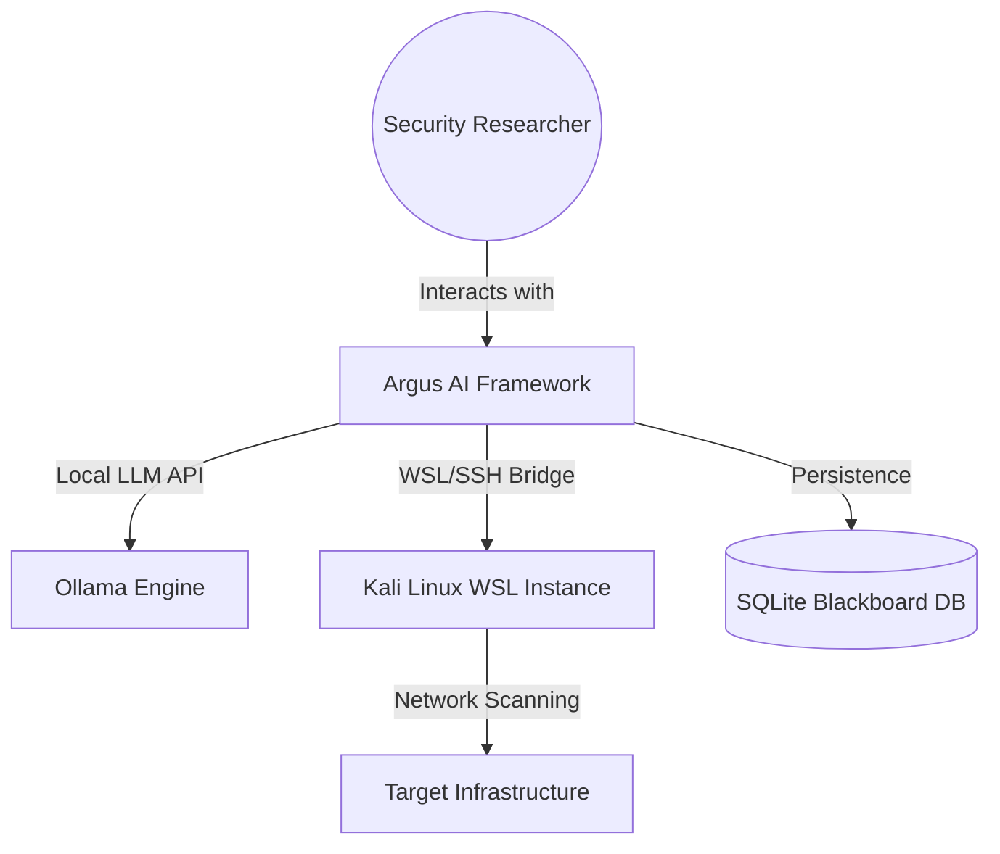

# 🛡️ Argus Security Framework: Technical Architecture (arc42 & C4)

This document provides an exhaustive technical breakdown of the **Argus Security Framework**. It follows the **arc42** architecture template and utilizes **C4 Model** abstractions to define the system's structure, behavior, and technical decisions.

---

## 1. Introduction and Goals
Argus is an autonomous AI-driven offensive security framework designed to automate reconnaissance, vulnerability discovery, and intelligence synthesis.

### 1.1 Requirements Overview
*   **Autonomous Operation:** High-level reasoning using `ReAct` logic.
*   **Platform Bridge:** Secure communication between Windows (Host) and Kali Linux (WSL).
*   **Intelligence Persistence:** Structured storage of findings for cross-session analysis.
*   **Extensibility:** Modular tool system (Nikto, FFUF, Nmap, etc.).

### 1.2 Quality Goals
1.  **Accuracy (High):** Minimize false positives through multi-tool verification (e.g., FFUF + Gobuster).
2.  **Stability (High):** Robust error handling via "Guided Reflection".
3.  **Privacy (Critical):** 100% local execution using Ollama and WSL.

---

## 2. Architecture Constraints
*   **OS:** Windows 10/11 with WSL 2 enabled.
*   **Kernel:** Kali Linux (Rolling) installed as the primary WSL distro.
*   **AI Engine:** Ollama running locally.
*   **Environment:** Python 3.12 isolated in `Argus_venv`.

---

## 3. System Context (C4 Level 1)

---

## 4. Solution Strategy
*   **Reasoning Layer:** Uses `LangChain` and `OllamaLLM` to process findings.
*   **Execution Layer (WSL Bridge):** A custom bridge that executes commands directly via `wsl.exe` or `paramiko` (SSH), ensuring seamless tool access.
*   **Structured Memory (Blackboard):** A shared database that allows different modules to read/write intelligence findings, preventing redundant scans.
*   **Guided Reflection:** A logic pattern where the AI analyzes tool failures (e.g., "Command not found") and suggests corrective actions (e.g., "apt install nikto").

---

## 5. Container View (C4 Level 2)

### 5.1 Argus Intelligence Brain (`core/agent.py`)
*   **Role:** The decision maker.
*   **Tech:** LangChain ReAct Agent.
*   **Input:** User goals + Context from Memory.

### 5.2 WSL Bridge & Security Arsenal (`core/tools.py`)
*   **Role:** The "Hands" of the system.
*   **Tools Integrated:**
    *   `argus_recon`: Native 5-phase subdomain engine.
    *   `Nikto`: Web vulnerability scanner.
    *   `FFUF`: Fast path discovery.
    *   `Nmap`: Port and service analysis.
    *   `Smart_Web_Search`: Real-time internet intelligence (DuckDuckGo).

### 5.3 Knowledge Graph Memory (`core/memory.py`)
*   **Role:** The "Memory" of the system.
*   **Schema:** Relational SQLite storing Entities (IPs, Domains) and Findings.

---

## 6. Runtime View (C4 Level 3)

### 6.1 Vulnerability Discovery Workflow
1.  **AI Thought:** "I found Apache 2.4.49. I need to check for known exploits."
2.  **Action:** `Smart_Web_Search(query="Apache 2.4.49 exploit")`.
3.  **Action:** `Run_Nikto(target)`.
4.  **Integration:** AI combines web intelligence with Nikto findings.
5.  **Output:** Synthesized report with suggested payloads from `Exploit_Suggester`.

---

### 7. Deployment View (C4 Level 4)

| Component | Path / Location | Configuration |
| :--- | :--- | :--- |
| Python Runtime | `Argus_venv/Scripts/python.exe` | v3.12 isolated |
| AI Model | `Ollama: WhiteRabbitNeo` | Localhost:11434 |
| WSL Bridge | `/usr/local/bin/argus_recon` | Kali Linux Root |
| Persistence | `./argus_intelligence.db` | SQLite 3 |
| Env Config | `./.env` | SSH & AI Secrets |

---

## 8. AI Intelligence Configuration (The Brain Parameters)
To minimize hallucinations and maximize technical precision, the Argus framework uses the following optimized LLM parameters:

| Parameter | Value | Technical Purpose |
| :--- | :--- | :--- |
| **Temperature** | 0.2 | Low randomness ensures deterministic and precise command generation. |
| **Max Tokens (num_predict)** | 4096 | Sufficient context window for complex tool output analysis. |
| **Top-P** | 0.9 | Filters low-probability tokens to maintain logical flow. |
| **Repeat Penalty** | 1.1 | Prevents the model from getting stuck in repetitive reasoning loops. |
| **Presence Penalty** | 0.1 | Encourages the agent to explore new reconnaissance phases. |

---

## 9. Cross-Cutting Concepts

### 8.1 Memory Management (The Blackboard)
Argus uses a **Shared Blackboard Pattern**. Instead of passing raw data between functions, every tool writes to the `Findings` table. The `get_blackboard_summary` function then aggregates this data for the AI's next "Thought" cycle.

### 8.2 Security & Isolation
*   All web scanning is proxied through the WSL network stack.
*   No secrets are stored in code; strictly using `.env`.

---

## 9. Architecture Decisions (ADR)
*   **ADR-001: Renaming to Argus_venv.** Decision: Standardize environment naming for brand consistency and script compatibility.
*   **ADR-002: Integration of SALMA Tools.** Decision: Adopt Nikto and FFUF to enhance web-layer vulnerability discovery.
*   **ADR-003: Pydantic + Markdown Reporting.** Decision: Use a hybrid output where JSON handles structured data and Markdown handles the human-readable report.

---

### 10. Advanced Multi-Agent Features

#### 10.1 Reflective Verification
- **Purpose:** Pre‑execution and post‑execution validation of tool actions to reduce false positives and improve reliability.
- **Components:** `reflective_verification.py` providing `pre_execute_verify`, `post_execute_verify`, and `task_difficulty_assessment`.
- **Integration:** Registered in `tool_registry.py` and exposed to the ArgusBrain as `Reflective_Pre_Verify`, `Reflective_Post_Verify`, `Task_Difficulty_Assessment`.
- **Workflow:** Before a tool runs, `pre_execute_verify` assesses context and predicts potential failure; after execution, `post_execute_verify` analyses output and triggers corrective reflection if needed.

#### 10.2 ZERO‑APT Simulation Engine
- **Purpose:** Simulate attacker‑defender‑judge cycles to benchmark adversarial tactics without real‑world impact.
- **Components:** `simulation.py` implementing the ZERO‑APT loop and STIX 2.0 report generation.
- **Integration:** Added to `tool_registry.py` as `ZERO_APT_Simulation` and wired into the ArgusBrain for automated red‑team exercises.
- **Outputs:** Produces structured STIX bundles for threat‑intel pipelines and feeds findings back into the shared memory store.

---
**Version:** 1.5 (Post-SALMA Integration)
**Status:** Approved Technical Baseline
**Author:** Argus Development Agent Team
