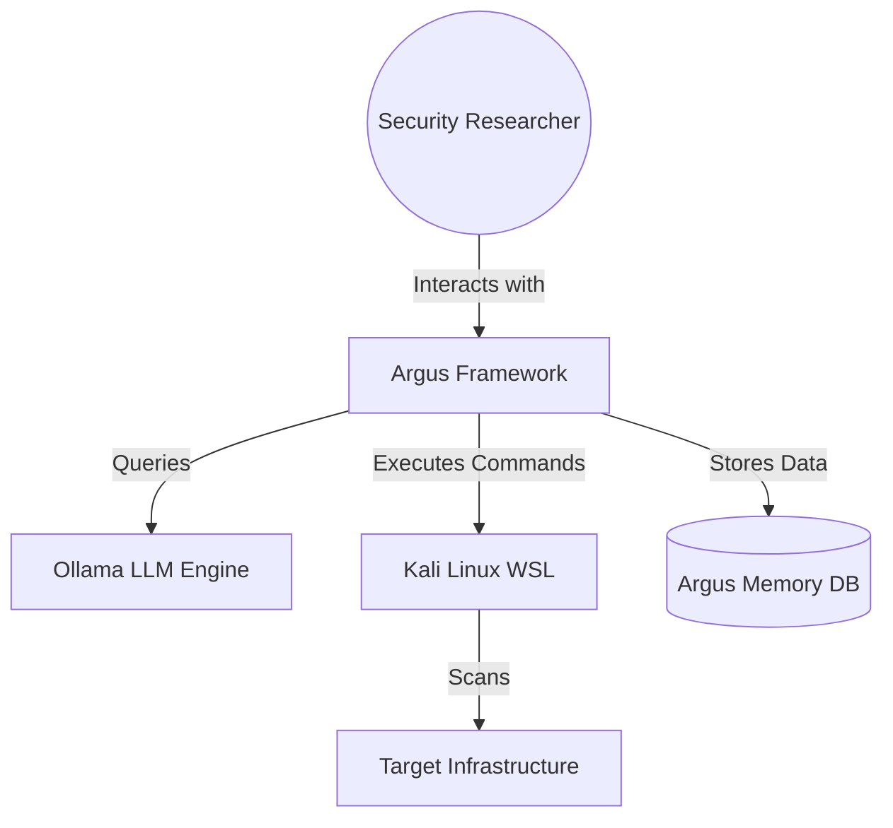

# Architecture Documentation: Argus Security Framework (arc42 & C4)

This document provides a detailed technical overview of the Argus Security Framework architecture, structured according to the **arc42** template and visualized using the **C4 Model** concepts.

---

## 1. Introduction and Goals

Argus is an autonomous AI-driven security reasoning engine that bridges the gap between high-level AI logic and low-level offensive security tools.

### 1.1 Goals
*   **Autonomy:** Minimize human intervention in reconnaissance and initial vulnerability discovery.
*   **Self-Healing:** Autonomously detect and resolve missing dependencies or tool failures.
*   **Tactical Orchestration:** Empower the AI to manage low-level tools directly via CLI for maximum flexibility.
*   **Reflective Verification:** Implement logic-based validation to eliminate false positives and WAF traps.
*   **Cross-Platform Integration:** Seamlessly bridge Windows (AI/GUI) and Kali Linux (Security Tools).
*   **Persistence:** Maintain a "Shared Blackboard" of intelligence across sessions.

---

## 2. Architecture Constraints
*   **Local Execution:** Must run locally (via Ollama) to ensure data privacy during pentesting.
*   **WSL Dependency:** Requires Windows Subsystem for Linux (Kali) for security tool access.
*   **Environment Isolation:** Python logic must reside in `Argus_venv`.

---

## 3. Context and Scope (C4 Level 1: System Context)

---

## 4. Solution Strategy
*   **Hybrid Language Model:** Using LangChain for reasoning (Brain) and Python Subprocess/SSH for execution (Body).
*   **Containerized Tooling:** Leveraging WSL as a "Tool Container" to avoid polluting the host OS.
*   **Graph-Based Memory:** Using SQLite to store not just raw text, but relationships (entities and relations).

---

## 5. Building Block View (C4 Level 2: Containers)

### 5.1 System Building Blocks
*   **Argus GUI (Streamlit):** The frontend providing a real-time view of the agent's "Thought" process.
*   **Argus Brain (core/agent.py):** The ReAct (Reasoning and Acting) controller.
*   **WSL Bridge (core/tools.py):** The execution layer that handles WSL/SSH communication.
*   **Specialized Tactical Modules (modules/):** Deep exploitation scripts (SQLi Bypass, RCE chaining).
*   **Archive Research Sub-agent:** Historical intelligence and web-search integrator.
*   **Argus Memory (core/memory.py):** The persistence layer (SQLite).

---

## 6. Runtime View (C4 Level 3: Components)

### 6.1 Reconnaissance Workflow
1.  **Input:** User provides a URL.
2.  **Reasoning:** `ArgusBrain` analyzes the task and selects `Check_Reachability`.
3.  **Bridge:** `WSLBridgeTools` sends a ping/curl command to Kali.
4.  **Action:** Kali executes the command and returns output.
5.  **Perception:** `ArgusBrain` reads the output, updates `ArgusMemory`, and decides on the next step (e.g., `Subdomain_Enumeration`).

---

## 7. Deployment View (C4 Level 4: Code/Infrastructure)

*   **Host OS:** Windows 10/11.
*   **AI Engine:** Ollama (Localhost:11434).
*   **Environment:** `Argus_venv` (Python 3.12).
*   **Virtualization:** WSL 2 (Distro: kali-linux).
*   **Bridge:** Local SSH (Port 22) or `wsl.exe` direct execution.

---

## 8. Cross-Cutting Concepts
*   **Security:** API keys and credentials managed via `.env`.
*   **Error Handling:** "Guided Reflection" - the system detects missing tools, syntax errors, and suggests corrective actions.
*   **Reflective Verification:** Mandatory multi-step validation (Content-Length/Header checks) for all discoveries to eliminate false positives and WAF redirects.
*   **WAF Evasion & IP Protection:** Automated block detection triggers emergency halt; stealth is enhanced via User-Agent rotation and randomized delays.
*   **Persistence:** SQLite database (`argus_intelligence.db`) with relational mapping for Knowledge Graph visualization.
*   **Automated Organization:** Centralized storage of tool-specific reports (e.g., `reports/nikto/`) with semantic, timestamped naming conventions.

---

## 9. Architecture Decisions (ADR)
*   **ADR 1: Why SQLite?** Chosen for simplicity and zero-configuration, while supporting relational data needed for the Knowledge Graph.
*   **ADR 2: Why WSL?** Provides a native Linux environment for industry-standard security tools while remaining accessible from Windows.
*   **ADR 3: Why LangChain ReAct?** Standardizes how the AI interacts with tools, allowing for complex multi-step reasoning.
*   **ADR 4: Autonomous Orchestration vs Static Scripts:** Shifted toward `Run_Kali_Command` to allow the AI to troubleshoot and pivot in real-time, reducing failure points in rigid bash scripts.
*   **ADR 5: Self-Healing Logic:** Implemented `system_self_heal` to reduce "agent downtime" by allowing the AI to fix its own environment (pip/apt) when encountering missing dependencies.
*   **ADR 6: Reflective Verification over Status-Only Discovery:** Mandated content-level validation because modern WAFs use deceptive "200 OK" redirects for non-existent files.
*   **ADR 7: Autonomous Syntax Learning:** Empowered the agent to run `--help` commands on-the-fly to fix its own command syntax, reducing manual tuning.
*   **ADR 8: Intelligent Rate-Limiting & IP Protection:** Implemented automated halt-on-block logic to protect the host's IP reputation during aggressive scanning.

---
*Created by Argus Security Framework Team - June 2026*
