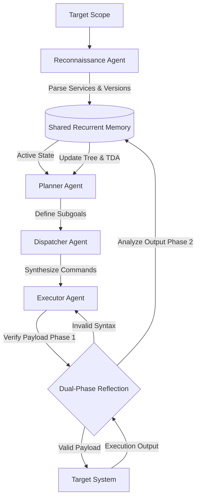

# Multi-Agent Penetration Testing Architectures & Reflective Verification

## 1. Technical Description
Multi-agent offensive security frameworks represent the transition from single-agent LLM systems—which suffer from context fragmentation, technical hallucinations, and memory degradation—to structured, stateful, and reflective architectures. Between 2023 and 2026, the field evolved from naive prompt wrappers to graph-based multi-agent systems coordinated by orchestration frameworks like LangGraph and MetaGPT.

These modern architectures decouple **strategic planning** (managing the overall attack tree, backtracking, and state management) from **concrete execution** (invoking specific tools, parsing outputs, and formatting syntax). The key features of these architectures include:
- **Shared Recurrent Memory Module (SRMM):** An immutable, write-once, read-many semantic state repository that prevents context corruption and keeps track of reconnaissance data, run commands, and findings.
- **Reflective Verification (Dual-Phase Reflection):**
  1. *Pre-execution verification:* Sanitizing and validating tool inputs and payloads to avoid syntax errors or unintended denial of service (DoS).
  2. *Post-execution analysis:* Introspecting server responses to adapt the strategy. Operation limits (typically capped at 10 consecutive iterations) prevent infinite analysis loops.
- **Evidence-Guided Attack Tree Search (EGATS):** Mathematical representation of attack states to direct search pathways using parameters like path length, evidence confidence, memory load, and historical success rates.
- **Attacker-Defender-Judge Simulation:** Closed-loop evaluation frameworks (such as ZERO-APT) that run adversarial testing against active defenders (powered by ELK/Sysmon and Sigma rules) with independent judges evaluating performance and outputs in STIX 2.0 formats.

---

## 2. Practical Classification with Payloads
Vulnerabilities and states in autonomous penetration testing are classified dynamically based on structural representation, payload customization, and retrieval systems.

### A. Graph and Tree Representation of Attack State
Instead of simple linear sequences, systems represent the penetration testing state as a directed graph:
$$G = (V, E, \lambda, \mu)$$
Where:
- $V$ is the set of discovered states/vulnerabilities.
- $E$ is the set of execution steps (transitions).
- $\lambda$ represents the evidence weights.
- $\mu$ represents the difficulty metrics.

### B. Context-Injected Payloads via RAG (CVE & CAPEC)
To generate highly accurate exploits, agents query vector databases (e.g., FAISS) populated with CVE descriptions, CWE definitions, and CAPEC attack patterns:
```python
# Conceptual search query for RAG embedding context injection
query_vector = embed("Apache ActiveMQ RCE CVE-2023-46604 Exploit")
results = vector_db.similarity_search(query_vector, k=3)
payload_template = results[0].metadata['exploit_template']
```

### C. LoRA Fine-Tuning (e.g., Qwen2.5-14B)
Medium-sized local models are fine-tuned using Low-Rank Adaptation (LoRA) on custom datasets (e.g., MITRE ATT&CK mappings, tool outputs) to generate payloads without leaking sensitive infrastructure data:
- **Training size:** ~1,644 high-fidelity offensive prompt-response pairs.
- **Result:** Local execution capability that matches or exceeds commercial giants (like Claude/GPT) in domain-specific tasks while maintaining strict data privacy.

---

## 3. Exploitation Methods
The typical execution flow of an autonomous multi-agent pentest is broken down into structured, isolated phases to maintain causal consistency:



### A. Phase-by-Phase Execution Flow
1. **Reconnaissance (Informationer):** Scans the target using specialized command runners (e.g., [ncat](file:///C:/AI_PenTest_Project/Argus/Argus_Master_Documentation.md#L75) or Nmap), outputting structured JSON to the SRMM.
2. **Task Difficulty Assessment (TDA):** The Planner assesses the difficulty of various entry points using:
   - Expected path length to privilege escalation.
   - Confidence score of service version details.
   - Historical success metrics of similar service vulnerabilities.
3. **Command Execution (Executor):** Translates high-level exploit commands into tool-specific inputs, sending them through the pre-execution reflection phase.
4. **Adversarial Adaptation (ZERO-APT Attacker):** If an active defender blocks a payload (e.g., killing a process or modifying firewall rules), the feedback loop triggers an immediate replanning phase using cosine similarity lookups in a failure-recovery database.

---

## 4. Relevant Tools/Techniques
Modern multi-agent architectures rely on a combination of orchestrators, vector search tools, local LLM deployment engines, and active target emulation tools:

- **LangGraph:** Used by frameworks like Red-MIRROR and xOffense for stateful, cyclic multi-agent routing.
- **MetaGPT:** Used by PenAgent to support role-based task execution and structured message-passing between agents.
- **Ollama / LoRA Frameworks:** Deploying local intelligence models (e.g., Qwen2.5-14B-LoRA, WhiteRabbitNeo) to execute logic loops without API overhead or data leakage.
- **FAISS-CPU:** Local vector search storage for caching successful exploit paths and service mappings (also implemented in [Argus](file:///C:/AI_PenTest_Project/Argus/Argus_Master_Documentation.md#L58)).
- **Atomic Red Team (775 Actions):** Serves as a constrained action library inside ZERO-APT to prevent agents from attempting invalid commands or operations.
- **ELK Stack / Sysmon / Sigma Rules:** Provides the foundational telemetry for active defense agents (Defender L2/L3) in closed-loop simulations.
- **STIX 2.0 Parser:** Formats judge transcripts and session logs into standard Cyber Threat Intelligence reports.

---

## 5. Practical Scenarios/Write-ups

### Case Study 1: Red-MIRROR vs. Web Application Target
- **Environment:** XBOW Benchmark (blind vulnerability evaluation).
- **Vulnerability:** Unauthenticated Remote Code Execution (RCE).
- **Execution Lifecycle:**
  1. The Planning Agent notices port `8080` open with `Apache ActiveMQ` signature in the SRMM.
  2. The Planning Agent sets the goal to exploit the service and delegates to the Execution Agent.
  3. The Execution Agent generates an initial payload using an outdated CVE template.
  4. The Dual-Phase Reflection engine flags the payload in Phase 1 (syntax review) due to an incorrect XML structure.
  5. The Execution Agent corrects the XML structure.
  6. The payload is sent to the target, causing a connection back to the listener.
  7. Phase 2 Reflection registers the connection, saves the root shell access credentials to the SRMM, and successfully marks the goal as completed.

### Case Study 2: ZERO-APT Closed-Loop Simulation
- **Objective:** Evaluate Attacker framework success rates under varying defensive postures.
- **Setup:** Attacker (Planner-Dispatcher-Executor) vs. Defender (L2 - SOC with Sigma rules) overseen by an independent Judge.
- **Scenario Execution:**
  1. The Attacker initiates a quiet port scan and identifies an SMB service.
  2. The Attacker attempts a standard SMB exploit.
  3. The Defender’s L2 rule triggers a high-severity alert in Sysmon logs (e.g., unexpected process spawned by `lsass.exe`).
  4. The Defender blocks the source IP address.
  5. The Judge relays a natural language warning to the Attacker: *"Defensive threshold exceeded; source IP is restricted."*
  6. The Attacker’s Planner immediately replans: it selects an alternative proxy node from the target network to route traffic and modifies execution parameters to lower the operational footprint (e.g., using living-off-the-land binaries).
  7. The Judge records the run, grades the defender's response and attacker's adaptation, and outputs a STIX 2.0 file detailing the session lifecycle.
